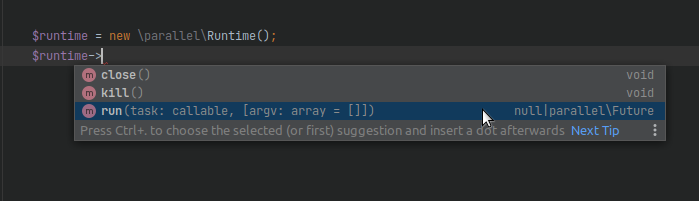

# PHP Parallel - IDE autocomplete

This package allows you to activate the auto-complete in the IDE for native functions from the extension: [PHP Parallel](https://www.php.net/manual/en/book.parallel.php).

## Installation

Install the library using Composer. Please read the [Composer Documentation](https://getcomposer.org/doc/01-basic-usage.md) if you are unfamiliar with Composer or dependency managers in general.

You don't need this package in production, please use `require-dev`.
```shell
composer require --dev boruta/php-parallel-ide-autocomplete
```

That's it, the IDE autocomplete should work.

## Requirements

Package requires PHP 7.2 or above and `ext-parallel` >= 1.1.4.

## About

If your IDE does not auto-complete functions from the PHP Parallel extension, add this package to your project to fix it. The directory `autocomplete` contains documentation of the functions from the extension mentioned above, without their implementation. This files are not automatically loaded by composer and you shouldn't include them. It's just their presence in the project directory, which fixes the missing documentation in the IDE. Just add the package to composer and your IDE should start displaying the documentation correctly.




